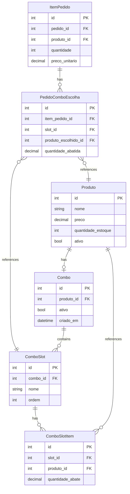

# Design Document - Sistema de Combos com Ficha Técnica

## Overview

Este documento descreve o design técnico para implementar um sistema de combos configuráveis com ficha técnica no sistema de cantina Django. O sistema permitirá criar produtos especiais do tipo "combo" onde cada combo possui múltiplos slots de escolha. Cada slot pode conter vários produtos do estoque disponíveis para seleção pelo cliente ou operador.

O design segue uma arquitetura de três camadas:
- **Camada de Dados**: Modelos Django para Combo, ComboSlot, ComboSlotItem e PedidoComboEscolha
- **Camada de Lógica**: Views e serviços para gerenciar combos e processar vendas
- **Camada de Apresentação**: Interfaces modais responsivas para configuração e seleção

## Architecture

### System Components

```
┌─────────────────────────────────────────────────────────────┐
│                     Frontend (JavaScript)                    │
├─────────────────────────────────────────────────────────────┤
│  Modal Configuração  │  Modal Seleção  │  Lista Produtos    │
└─────────────────────────────────────────────────────────────┘
                              ↕
┌─────────────────────────────────────────────────────────────┐
│                    Backend (Django Views)                    │
├─────────────────────────────────────────────────────────────┤
│  ComboConfigView  │  ComboSelectionView  │  PedidoView      │
└─────────────────────────────────────────────────────────────┘
                              ↕
┌─────────────────────────────────────────────────────────────┐
│                      Business Logic                          │
├─────────────────────────────────────────────────────────────┤
│  ComboService  │  EstoqueService  │  PedidoService          │
└─────────────────────────────────────────────────────────────┘
                              ↕
┌─────────────────────────────────────────────────────────────┐
│                      Data Layer (Models)                     │
├─────────────────────────────────────────────────────────────┤
│  Combo  │  ComboSlot  │  ComboSlotItem  │  PedidoComboEscolha│
└─────────────────────────────────────────────────────────────┘
```

### Data Flow

1. **Configuração de Combo**: Admin → Modal Config → ComboConfigView → ComboService → Models
2. **Venda de Combo**: Operador → Modal Seleção → ComboSelectionView → PedidoService → Abate Estoque
3. **Consulta de Pedido**: Sistema → PedidoView → Renderização com detalhes do combo


## Components and Interfaces

### Backend Models

#### Combo Model
```python
class Combo(models.Model):
    """
    Representa um produto do tipo combo.
    Relaciona-se com Produto através de OneToOne ou herança.
    """
    produto = models.OneToOneField(Produto, on_delete=models.CASCADE, related_name='combo')
    ativo = models.BooleanField(default=True)
    criado_em = models.DateTimeField(auto_now_add=True)
    atualizado_em = models.DateTimeField(auto_now=True)
    
    def validar_integridade(self):
        """Valida que o combo tem pelo menos um slot com itens"""
        pass
    
    def obter_slots_ordenados(self):
        """Retorna slots ordenados por ordem de exibição"""
        pass
```

#### ComboSlot Model
```python
class ComboSlot(models.Model):
    """
    Representa um slot de escolha dentro de um combo.
    Ex: "Escolha seu Pastel", "Escolha sua Bebida"
    """
    combo = models.ForeignKey(Combo, on_delete=models.CASCADE, related_name='slots')
    nome = models.CharField(max_length=100)
    ordem = models.IntegerField(default=0)
    criado_em = models.DateTimeField(auto_now_add=True)
    
    class Meta:
        ordering = ['ordem']
        unique_together = [['combo', 'ordem']]
    
    def obter_itens_ativos(self):
        """Retorna apenas itens componentes com produtos ativos"""
        pass
```

#### ComboSlotItem Model
```python
class ComboSlotItem(models.Model):
    """
    Representa um produto que pode ser escolhido em um slot.
    Define a quantidade que será abatida do estoque.
    """
    slot = models.ForeignKey(ComboSlot, on_delete=models.CASCADE, related_name='itens')
    produto = models.ForeignKey(Produto, on_delete=models.PROTECT)
    quantidade_abate = models.DecimalField(max_digits=10, decimal_places=3)
    criado_em = models.DateTimeField(auto_now_add=True)
    
    class Meta:
        unique_together = [['slot', 'produto']]
    
    def validar_estoque_disponivel(self):
        """Verifica se há estoque suficiente do produto"""
        pass
```

#### PedidoComboEscolha Model
```python
class PedidoComboEscolha(models.Model):
    """
    Registra as escolhas feitas para cada slot de um combo vendido.
    """
    item_pedido = models.ForeignKey(ItemPedido, on_delete=models.CASCADE, related_name='escolhas_combo')
    slot = models.ForeignKey(ComboSlot, on_delete=models.PROTECT)
    produto_escolhido = models.ForeignKey(Produto, on_delete=models.PROTECT)
    quantidade_abatida = models.DecimalField(max_digits=10, decimal_places=3)
    criado_em = models.DateTimeField(auto_now_add=True)
    
    class Meta:
        unique_together = [['item_pedido', 'slot']]
```

### Backend Services

#### ComboService
```python
class ComboService:
    """Serviço para gerenciar operações de combos"""
    
    @staticmethod
    def criar_combo(produto_id, slots_data):
        """
        Cria um combo com seus slots e itens componentes.
        
        Args:
            produto_id: ID do produto base
            slots_data: Lista de dicts com dados dos slots e itens
        
        Returns:
            Combo criado
        
        Raises:
            ValidationError: Se dados inválidos
        """
        pass
    
    @staticmethod
    def atualizar_combo(combo_id, slots_data):
        """Atualiza configuração de um combo existente"""
        pass
    
    @staticmethod
    def validar_combo_para_venda(combo_id):
        """
        Valida se combo pode ser vendido.
        Verifica se todos os slots têm itens ativos com estoque.
        """
        pass
    
    @staticmethod
    def obter_opcoes_slots(combo_id):
        """Retorna estrutura de dados com opções para cada slot"""
        pass
```

#### EstoqueService
```python
class EstoqueService:
    """Serviço para gerenciar operações de estoque"""
    
    @staticmethod
    def abater_estoque_combo(escolhas):
        """
        Abate estoque dos produtos escolhidos em um combo.
        
        Args:
            escolhas: Lista de dicts com produto_id e quantidade_abate
        
        Raises:
            EstoqueInsuficienteError: Se algum produto não tem estoque
        """
        pass
    
    @staticmethod
    def validar_estoque_disponivel(escolhas):
        """Valida se há estoque suficiente para todas as escolhas"""
        pass
    
    @staticmethod
    def reverter_abate_combo(escolhas):
        """Reverte abate de estoque (para cancelamentos)"""
        pass
```


### Backend Views

#### ComboConfigView
```python
@login_required
@require_http_methods(["GET", "POST"])
def configurar_combo(request, produto_id):
    """
    View para configurar slots e itens de um combo.
    
    GET: Retorna dados atuais do combo em JSON
    POST: Atualiza configuração do combo
    """
    if request.method == "GET":
        # Retornar estrutura atual do combo
        pass
    else:
        # Validar e salvar nova configuração
        pass
```

#### ComboSelectionView
```python
@login_required
@require_http_methods(["POST"])
def obter_opcoes_combo(request, combo_id):
    """
    Retorna opções disponíveis para cada slot do combo.
    Usado para popular o modal de seleção.
    """
    pass
```

#### PedidoComboView
```python
@login_required
@require_http_methods(["POST"])
def adicionar_combo_pedido(request):
    """
    Adiciona um combo ao pedido com as escolhas selecionadas.
    
    Request body:
    {
        "combo_id": 1,
        "escolhas": [
            {"slot_id": 1, "produto_id": 5},
            {"slot_id": 2, "produto_id": 8}
        ]
    }
    """
    pass
```

### Frontend Components

#### Modal de Configuração (config-combo-modal.js)
```javascript
class ComboConfigModal {
    constructor(comboId) {
        this.comboId = comboId;
        this.slots = [];
    }
    
    async carregar() {
        // Buscar dados do combo via API
        // Renderizar slots e itens
    }
    
    adicionarSlot() {
        // Adicionar novo slot à interface
    }
    
    removerSlot(slotIndex) {
        // Remover slot da interface
    }
    
    adicionarItemSlot(slotIndex, produtoId, quantidadeAbate) {
        // Adicionar item componente a um slot
    }
    
    removerItemSlot(slotIndex, itemIndex) {
        // Remover item componente de um slot
    }
    
    async salvar() {
        // Validar dados
        // Enviar para backend via POST
    }
    
    renderizar() {
        // Renderizar HTML do modal
    }
}
```

#### Modal de Seleção (selecao-combo-modal.js)
```javascript
class ComboSelectionModal {
    constructor(comboId) {
        this.comboId = comboId;
        this.escolhas = {};
    }
    
    async carregar() {
        // Buscar opções de slots via API
        // Renderizar campos de seleção
    }
    
    selecionarItem(slotId, produtoId) {
        // Registrar escolha do usuário
        this.escolhas[slotId] = produtoId;
    }
    
    validarSelecao() {
        // Verificar se todos os slots foram preenchidos
        // Retornar true/false
    }
    
    async confirmar() {
        // Validar seleção
        // Enviar escolhas para backend
        // Adicionar combo ao carrinho
    }
    
    renderizar() {
        // Renderizar HTML do modal com campos dinâmicos
    }
}
```

#### Integração com Caixa (caixa.js)
```javascript
// Modificar função adicionarProduto existente
function adicionarProduto(id, nome, preco, isCombo) {
    if (isCombo) {
        // Abrir modal de seleção de combo
        const modal = new ComboSelectionModal(id);
        modal.carregar();
        modal.show();
    } else {
        // Lógica existente para produtos normais
        // ... código atual ...
    }
}

// Nova função para adicionar combo após seleção
function adicionarComboAoPedido(comboId, nome, preco, escolhas) {
    itensPedido.push({
        produto_id: comboId,
        nome: nome,
        preco: parseFloat(preco),
        quantidade: 1,
        is_combo: true,
        escolhas: escolhas,
        observacoes: ''
    });
    
    atualizarListaItens();
}
```


## Data Models

### Database Schema



### Data Validation Rules

1. **Combo**:
   - Deve ter pelo menos 1 slot
   - Produto relacionado deve existir e estar ativo

2. **ComboSlot**:
   - Nome não pode ser vazio
   - Ordem deve ser única dentro do combo
   - Deve ter pelo menos 1 item componente para ser vendável

3. **ComboSlotItem**:
   - Quantidade de abate deve ser > 0
   - Produto deve existir
   - Combinação slot + produto deve ser única

4. **PedidoComboEscolha**:
   - Deve referenciar um ItemPedido válido
   - Slot deve pertencer ao combo do ItemPedido
   - Produto escolhido deve estar nos itens componentes do slot
   - Combinação item_pedido + slot deve ser única

### API Response Formats

#### GET /caixa/combo/{combo_id}/opcoes/
```json
{
    "combo_id": 1,
    "nome": "Combo Pastel",
    "preco": 15.00,
    "slots": [
        {
            "id": 1,
            "nome": "Escolha seu Pastel",
            "ordem": 1,
            "itens": [
                {
                    "produto_id": 5,
                    "nome": "Pastel de Carne",
                    "quantidade_abate": 1.0,
                    "estoque_disponivel": 20
                },
                {
                    "produto_id": 6,
                    "nome": "Pastel de Queijo",
                    "quantidade_abate": 1.0,
                    "estoque_disponivel": 15
                }
            ]
        },
        {
            "id": 2,
            "nome": "Escolha sua Bebida",
            "ordem": 2,
            "itens": [
                {
                    "produto_id": 10,
                    "nome": "Coca-Cola 350ml",
                    "quantidade_abate": 1.0,
                    "estoque_disponivel": 50
                }
            ]
        }
    ]
}
```

#### POST /caixa/adicionar-combo-pedido/
Request:
```json
{
    "combo_id": 1,
    "escolhas": [
        {"slot_id": 1, "produto_id": 5},
        {"slot_id": 2, "produto_id": 10}
    ]
}
```

Response:
```json
{
    "success": true,
    "item_pedido": {
        "id": 123,
        "produto_nome": "Combo Pastel",
        "preco": 15.00,
        "escolhas": [
            {"slot_nome": "Escolha seu Pastel", "produto_nome": "Pastel de Carne"},
            {"slot_nome": "Escolha sua Bebida", "produto_nome": "Coca-Cola 350ml"}
        ]
    }
}
```


## Correctness Properties

*Uma propriedade é uma característica ou comportamento que deve ser verdadeiro em todas as execuções válidas de um sistema - essencialmente, uma declaração formal sobre o que o sistema deve fazer. Propriedades servem como ponte entre especificações legíveis por humanos e garantias de correção verificáveis por máquina.*

### Property 1: Criação de Combo com Atributos Válidos
*Para qualquer* produto marcado como combo com nome e preço válidos, criar o combo deve resultar em um registro Combo persistido com os mesmos atributos.
**Validates: Requirements 1.1, 1.2**

### Property 2: Adição de Múltiplos Slots
*Para qualquer* combo e qualquer lista de slots com nomes válidos, adicionar os slots deve resultar em todos os slots sendo persistidos e associados ao combo.
**Validates: Requirements 1.3, 1.5**

### Property 3: Validação de Nome de Slot Obrigatório
*Para qualquer* tentativa de criar um slot sem nome ou com nome vazio, o sistema deve rejeitar a operação e retornar erro de validação.
**Validates: Requirements 1.4, 7.3**

### Property 4: Vinculação de Múltiplos Produtos a Slot
*Para qualquer* slot e qualquer lista de produtos ativos com quantidades de abate válidas, vincular os produtos deve resultar em todos os ComboSlotItem sendo criados corretamente.
**Validates: Requirements 2.1, 2.5**

### Property 5: Validação de Quantidade de Abate Positiva
*Para qualquer* tentativa de vincular um produto a um slot com quantidade de abate menor ou igual a zero, o sistema deve rejeitar a operação.
**Validates: Requirements 2.2, 2.3**

### Property 6: Filtragem de Produtos Ativos
*Para qualquer* slot, ao buscar produtos disponíveis para vinculação, o sistema deve retornar apenas produtos com ativo=True.
**Validates: Requirements 2.6**

### Property 7: Remoção de Itens Componentes
*Para qualquer* ComboSlotItem existente, removê-lo deve resultar no item não estar mais associado ao slot.
**Validates: Requirements 2.4**

### Property 8: Renderização Dinâmica de Slots no Modal de Seleção
*Para qualquer* combo com N slots, o modal de seleção deve renderizar exatamente N campos de seleção, um para cada slot.
**Validates: Requirements 4.2, 4.3**

### Property 9: Exibição de Todos os Itens Componentes
*Para qualquer* slot com M itens componentes ativos, o campo de seleção deve exibir todos os M produtos como opções.
**Validates: Requirements 4.4**

### Property 10: Validação de Seleção Completa
*Para qualquer* combo com N slots, tentar confirmar a seleção com menos de N escolhas deve resultar em erro de validação e impedir a confirmação.
**Validates: Requirements 4.5, 4.6**

### Property 11: Adição de Combo ao Pedido com Escolhas
*Para qualquer* combo com todos os slots preenchidos, confirmar a seleção deve criar um ItemPedido e N registros PedidoComboEscolha (um para cada slot).
**Validates: Requirements 4.7, 5.1, 5.2**

### Property 12: Armazenamento Completo de Escolhas
*Para qualquer* PedidoComboEscolha criado, o registro deve conter slot_id, produto_escolhido_id e quantidade_abatida não nulos.
**Validates: Requirements 5.3**

### Property 13: Integridade Referencial de Escolhas
*Para qualquer* ItemPedido de combo deletado, todos os PedidoComboEscolha relacionados devem ser deletados em cascata.
**Validates: Requirements 5.4**

### Property 14: Recuperação de Detalhes de Combo em Pedido
*Para qualquer* pedido contendo combo, consultar o pedido deve retornar o combo com todas as escolhas de cada slot.
**Validates: Requirements 5.5**

### Property 15: Abate de Estoque com Quantidade Correta
*Para qualquer* pedido confirmado contendo combo, o estoque de cada produto escolhido deve ser reduzido pela quantidade_abate definida na ficha técnica.
**Validates: Requirements 6.1, 6.2**

### Property 16: Validação de Estoque Insuficiente
*Para qualquer* tentativa de confirmar pedido onde algum produto escolhido tem estoque menor que a quantidade_abate, o sistema deve rejeitar a operação.
**Validates: Requirements 6.3**

### Property 17: Atualização Imediata de Estoque
*Para qualquer* abate de estoque realizado, consultas subsequentes ao produto devem refletir a nova quantidade imediatamente.
**Validates: Requirements 6.4**

### Property 18: Validação Preventiva de Estoque no Modal
*Para qualquer* produto componente com estoque insuficiente, o item não deve aparecer como opção selecionável no modal ou deve aparecer desabilitado.
**Validates: Requirements 6.5**

### Property 19: Proteção de Produtos Vinculados
*Para qualquer* produto que é item componente de um combo ativo, tentar deletar o produto deve resultar em erro de integridade.
**Validates: Requirements 7.1**

### Property 20: Validação de Combo sem Slots
*Para qualquer* tentativa de criar ou ativar um combo sem slots, o sistema deve rejeitar a operação.
**Validates: Requirements 7.4**

### Property 21: Validação de Slots com Itens Ativos
*Para qualquer* combo sendo adicionado ao pedido, o sistema deve validar que todos os slots possuem pelo menos um item componente com produto ativo.
**Validates: Requirements 7.5**

### Property 22: Estrutura de Renderização de Combo em Pedido
*Para qualquer* pedido contendo combo, a renderização deve incluir o nome do combo como item principal e, para cada escolha, o nome do slot e o produto escolhido como sub-itens.
**Validates: Requirements 9.1, 9.2, 9.3**

### Property 23: Detalhes Completos em Views de Cozinha e Impressão
*Para qualquer* pedido com combo, tanto a view de cozinha quanto o comprovante impresso devem conter todos os detalhes: nome do combo e todas as escolhas de slots.
**Validates: Requirements 9.4, 9.5**

### Property 24: Precisão Decimal de Quantidade de Abate
*Para qualquer* quantidade de abate definida com até 3 casas decimais, o valor deve ser armazenado e recuperado com precisão exata.
**Validates: Requirements 10.4**

### Property 25: Reordenação de Slots
*Para qualquer* conjunto de slots reordenados, salvar a nova ordem deve resultar em consultas subsequentes retornando os slots na ordem atualizada.
**Validates: Requirements 10.5**

### Property 26: Round-trip de Configuração de Combo
*Para qualquer* combo configurado com slots e itens, buscar a configuração via API, modificar localmente e salvar novamente deve preservar todos os dados não modificados.
**Validates: Requirements 3.4, 3.5, 3.6, 3.7**


## Error Handling

### Validation Errors

#### ComboValidationError
- **Trigger**: Tentativa de criar combo sem slots ou com dados inválidos
- **Response**: HTTP 400 com mensagem descritiva
- **User Message**: "Não é possível criar um combo sem slots. Adicione pelo menos um slot."

#### SlotValidationError
- **Trigger**: Tentativa de criar slot sem nome ou com nome vazio
- **Response**: HTTP 400 com mensagem descritiva
- **User Message**: "O nome do slot é obrigatório."

#### QuantidadeAbateInvalidaError
- **Trigger**: Quantidade de abate <= 0 ou não numérica
- **Response**: HTTP 400 com mensagem descritiva
- **User Message**: "A quantidade de abate deve ser um número positivo maior que zero."

#### SelecaoIncompletaError
- **Trigger**: Tentativa de confirmar combo sem preencher todos os slots
- **Response**: HTTP 400 com lista de slots não preenchidos
- **User Message**: "Por favor, selecione um item para todos os slots: [lista de slots faltantes]"

### Business Logic Errors

#### EstoqueInsuficienteError
- **Trigger**: Estoque do produto < quantidade_abate necessária
- **Response**: HTTP 409 com detalhes do produto
- **User Message**: "Estoque insuficiente para [nome_produto]. Disponível: [quantidade], Necessário: [quantidade_abate]"
- **Recovery**: Sugerir produtos alternativos do mesmo slot

#### ProdutoInativoError
- **Trigger**: Tentativa de usar produto desativado em combo
- **Response**: HTTP 400 com ID do produto
- **User Message**: "O produto [nome_produto] está inativo e não pode ser usado."
- **Recovery**: Filtrar produtos inativos automaticamente

#### ComboIncompletoError
- **Trigger**: Tentativa de vender combo com slots sem itens componentes
- **Response**: HTTP 400 com lista de slots vazios
- **User Message**: "Este combo não pode ser vendido. Os seguintes slots não têm opções configuradas: [lista de slots]"
- **Recovery**: Redirecionar para configuração do combo

### Data Integrity Errors

#### ProdutoVinculadoError
- **Trigger**: Tentativa de deletar produto usado em combo ativo
- **Response**: HTTP 409 com lista de combos afetados
- **User Message**: "Não é possível excluir este produto. Ele está sendo usado nos seguintes combos: [lista de combos]"
- **Recovery**: Sugerir desativar produto ao invés de deletar

#### IntegridadeReferencialError
- **Trigger**: Violação de foreign key ou unique constraint
- **Response**: HTTP 500 com log detalhado
- **User Message**: "Erro ao processar operação. Por favor, tente novamente."
- **Recovery**: Rollback automático da transação

### Network and System Errors

#### TimeoutError
- **Trigger**: Requisição excede tempo limite (30s)
- **Response**: HTTP 504
- **User Message**: "A operação está demorando mais que o esperado. Por favor, tente novamente."
- **Recovery**: Retry automático com backoff exponencial (máximo 3 tentativas)

#### DatabaseConnectionError
- **Trigger**: Falha na conexão com banco de dados
- **Response**: HTTP 503
- **User Message**: "Sistema temporariamente indisponível. Tente novamente em alguns instantes."
- **Recovery**: Exibir modo offline, salvar operações em localStorage para retry

### Error Logging Strategy

Todos os erros devem ser logados com:
- Timestamp
- User ID e Empresa ID
- Tipo de erro
- Stack trace (para erros 500)
- Request payload (sanitizado, sem dados sensíveis)
- Response enviado ao cliente

Formato de log:
```python
logger.error(
    f"[{error_type}] User: {user_id}, Empresa: {empresa_id}, "
    f"Endpoint: {request.path}, Error: {error_message}",
    extra={
        'stack_trace': traceback.format_exc(),
        'request_data': sanitize_data(request.data)
    }
)
```


## Testing Strategy

### Dual Testing Approach

Este projeto utilizará uma abordagem dupla de testes:

1. **Unit Tests**: Verificam exemplos específicos, casos extremos e condições de erro
2. **Property-Based Tests**: Verificam propriedades universais através de múltiplas entradas geradas

Ambos os tipos de teste são complementares e necessários para cobertura abrangente. Unit tests capturam bugs concretos e casos específicos, enquanto property tests verificam correção geral através de randomização.

### Property-Based Testing Configuration

**Framework**: Hypothesis (Python)

**Configuração**:
- Mínimo de 100 iterações por teste de propriedade
- Cada teste deve referenciar sua propriedade no documento de design
- Formato de tag: `# Feature: combos-ficha-tecnica, Property {number}: {property_text}`

**Exemplo de Teste de Propriedade**:
```python
from hypothesis import given, strategies as st
import pytest

# Feature: combos-ficha-tecnica, Property 1: Criação de Combo com Atributos Válidos
@given(
    nome=st.text(min_size=1, max_size=200),
    preco=st.decimals(min_value=0.01, max_value=9999.99, places=2)
)
def test_criar_combo_preserva_atributos(nome, preco):
    """
    Para qualquer produto marcado como combo com nome e preço válidos,
    criar o combo deve resultar em um registro Combo persistido com os mesmos atributos.
    """
    produto = Produto.objects.create(
        empresa=empresa_teste,
        nome=nome,
        preco=preco,
        ativo=True
    )
    
    combo = Combo.objects.create(produto=produto)
    combo.refresh_from_db()
    
    assert combo.produto.nome == nome
    assert combo.produto.preco == preco
    assert combo.ativo == True
```

### Unit Testing Strategy

**Framework**: pytest-django

**Áreas de Foco**:
1. **Casos Extremos**:
   - Combos com 2 slots (mínimo)
   - Combos com 10 slots (máximo)
   - Slots com 1 item componente (mínimo)
   - Slots com 50 itens componentes (máximo)
   - Quantidades de abate com 3 casas decimais

2. **Condições de Erro**:
   - Tentativa de criar combo sem slots
   - Tentativa de criar slot sem nome
   - Tentativa de vincular produto com quantidade_abate = 0
   - Tentativa de confirmar combo com seleção incompleta
   - Tentativa de vender combo com estoque insuficiente

3. **Integração entre Componentes**:
   - Fluxo completo: criar combo → configurar slots → vender → abater estoque
   - Cancelamento de pedido com combo → reverter estoque
   - Desativar produto → verificar avisos em combos relacionados

**Exemplo de Unit Test**:
```python
def test_combo_minimo_dois_slots():
    """Testa que combo pode ser criado com exatamente 2 slots (caso extremo mínimo)"""
    produto = Produto.objects.create(
        empresa=empresa_teste,
        nome="Combo Mínimo",
        preco=10.00
    )
    combo = Combo.objects.create(produto=produto)
    
    slot1 = ComboSlot.objects.create(combo=combo, nome="Slot 1", ordem=1)
    slot2 = ComboSlot.objects.create(combo=combo, nome="Slot 2", ordem=2)
    
    assert combo.slots.count() == 2
    assert combo.validar_integridade() == True

def test_estoque_insuficiente_impede_venda():
    """Testa que venda é impedida quando estoque é insuficiente"""
    # Setup: criar combo com produto que tem estoque = 1
    produto_componente = Produto.objects.create(
        empresa=empresa_teste,
        nome="Produto Escasso",
        preco=5.00,
        quantidade_estoque=1
    )
    
    # Criar combo e vincular produto com quantidade_abate = 2
    combo = criar_combo_teste()
    slot = combo.slots.first()
    ComboSlotItem.objects.create(
        slot=slot,
        produto=produto_componente,
        quantidade_abate=2.0
    )
    
    # Tentar vender combo
    escolhas = [{"slot_id": slot.id, "produto_id": produto_componente.id}]
    
    with pytest.raises(EstoqueInsuficienteError):
        EstoqueService.validar_estoque_disponivel(escolhas)
```

### Integration Testing

**Áreas de Foco**:
1. **API Endpoints**:
   - GET /caixa/combo/{id}/opcoes/ retorna estrutura correta
   - POST /caixa/configurar-combo/ persiste dados corretamente
   - POST /caixa/adicionar-combo-pedido/ cria registros e abate estoque

2. **Frontend-Backend Integration**:
   - Modal de configuração carrega e salva dados corretamente
   - Modal de seleção valida e envia escolhas corretamente
   - Carrinho exibe combos com detalhes completos

**Exemplo de Integration Test**:
```python
def test_fluxo_completo_venda_combo(client, usuario_teste):
    """Testa fluxo completo: configurar combo → selecionar itens → confirmar pedido → abater estoque"""
    client.force_login(usuario_teste)
    
    # 1. Criar e configurar combo
    produto = Produto.objects.create(empresa=usuario_teste.empresa, nome="Combo Teste", preco=20.00)
    combo = Combo.objects.create(produto=produto)
    slot = ComboSlot.objects.create(combo=combo, nome="Escolha", ordem=1)
    
    produto_componente = Produto.objects.create(
        empresa=usuario_teste.empresa,
        nome="Item Componente",
        preco=10.00,
        quantidade_estoque=10
    )
    ComboSlotItem.objects.create(slot=slot, produto=produto_componente, quantidade_abate=1.0)
    
    # 2. Obter opções do combo
    response = client.get(f'/caixa/combo/{combo.id}/opcoes/')
    assert response.status_code == 200
    data = response.json()
    assert len(data['slots']) == 1
    
    # 3. Adicionar combo ao pedido
    response = client.post('/caixa/adicionar-combo-pedido/', {
        'combo_id': combo.id,
        'escolhas': [{'slot_id': slot.id, 'produto_id': produto_componente.id}]
    }, content_type='application/json')
    assert response.status_code == 200
    
    # 4. Verificar que estoque foi abatido
    produto_componente.refresh_from_db()
    assert produto_componente.quantidade_estoque == 9
```

### Frontend Testing

**Framework**: Jest + Testing Library

**Áreas de Foco**:
1. **Renderização de Componentes**:
   - Modal de configuração renderiza slots corretamente
   - Modal de seleção adapta-se ao número de slots
   - Validação de formulários funciona corretamente

2. **Interações do Usuário**:
   - Adicionar/remover slots
   - Selecionar itens em cada slot
   - Validação antes de confirmar

**Exemplo de Frontend Test**:
```javascript
describe('ComboSelectionModal', () => {
    test('renderiza campo de seleção para cada slot', async () => {
        const comboData = {
            slots: [
                { id: 1, nome: 'Slot 1', itens: [...] },
                { id: 2, nome: 'Slot 2', itens: [...] }
            ]
        };
        
        const modal = new ComboSelectionModal(1);
        modal.slots = comboData.slots;
        modal.renderizar();
        
        const selects = document.querySelectorAll('.slot-select');
        expect(selects.length).toBe(2);
    });
    
    test('impede confirmação com seleção incompleta', () => {
        const modal = new ComboSelectionModal(1);
        modal.slots = [{ id: 1 }, { id: 2 }];
        modal.escolhas = { 1: 5 }; // Apenas 1 de 2 slots preenchido
        
        expect(modal.validarSelecao()).toBe(false);
    });
});
```

### Test Coverage Goals

- **Backend Models**: 95% de cobertura de linha
- **Backend Services**: 90% de cobertura de linha
- **Backend Views**: 85% de cobertura de linha
- **Frontend Components**: 80% de cobertura de linha

### Continuous Integration

Todos os testes devem passar antes de merge:
```bash
# Backend
pytest --cov=caixa --cov-report=html --cov-fail-under=85

# Frontend
npm test -- --coverage --coverageThreshold='{"global":{"lines":80}}'
```

## Implementation Notes

### Current Status

Os modelos de dados (Combo, ComboSlot, ComboSlotItem, PedidoComboEscolha) já foram implementados no arquivo `caixa/models.py` e estão alinhados com este design. A implementação inclui:

- Relacionamento OneToOne entre Produto e Combo
- Validação de integridade através do método `validar_integridade()`
- Ordenação automática de slots através de Meta.ordering
- Proteção de produtos vinculados através de on_delete=PROTECT
- Suporte a quantidades decimais com 3 casas (quantidade_abate)

### Próximos Passos de Implementação

1. **Backend Services**: Implementar ComboService e EstoqueService conforme especificado
2. **Backend Views**: Criar endpoints para configuração e seleção de combos
3. **Frontend Modals**: Desenvolver interfaces JavaScript para configuração e seleção
4. **Integração com Caixa**: Modificar caixa.js para suportar adição de combos
5. **Testes**: Implementar property-based tests e unit tests conforme estratégia definida

### Considerações de Migração

Para aplicar os modelos ao banco de dados:
```bash
python manage.py makemigrations caixa
python manage.py migrate
```

### Considerações de Performance

- **Índices**: Os campos `combo`, `ordem`, `slot`, e `item_pedido` já possuem índices automáticos via ForeignKey
- **Queries N+1**: Usar `select_related()` e `prefetch_related()` ao buscar combos com slots e itens
- **Cache**: Considerar cache de configurações de combo para reduzir queries em vendas frequentes

Exemplo de query otimizada:
```python
combo = Combo.objects.select_related('produto').prefetch_related(
    'slots__itens__produto'
).get(id=combo_id)
```

### Segurança

- **Validação de Empresa**: Todas as operações devem validar que o usuário pertence à mesma empresa do combo
- **Proteção CSRF**: Todos os endpoints POST devem incluir token CSRF
- **Sanitização**: Inputs de usuário devem ser sanitizados antes de persistir
- **Autorização**: Apenas usuários com permissão de operador/admin podem configurar combos

### Compatibilidade

- **Django**: Versão 3.2+ (LTS)
- **Python**: 3.8+
- **Browsers**: Chrome 90+, Firefox 88+, Safari 14+, Edge 90+
- **Mobile**: iOS 14+, Android 8+
