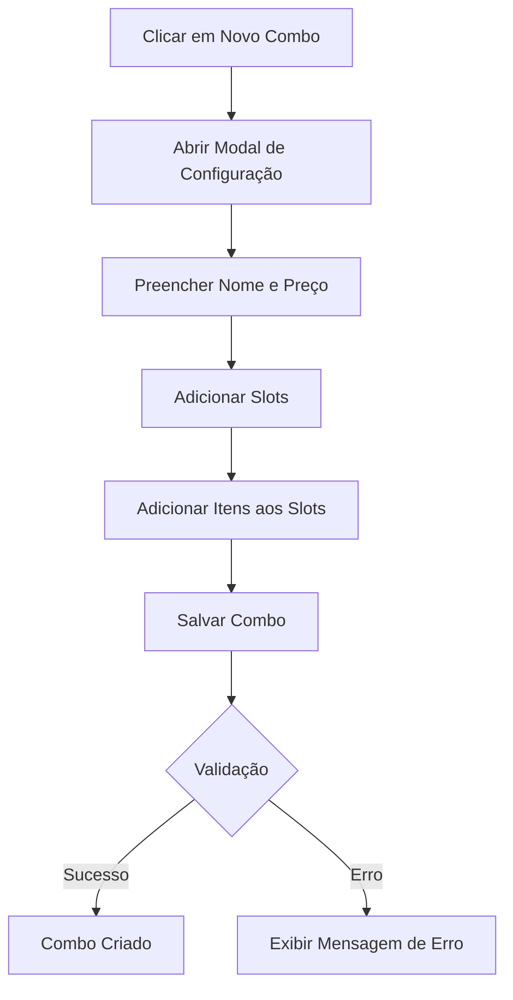
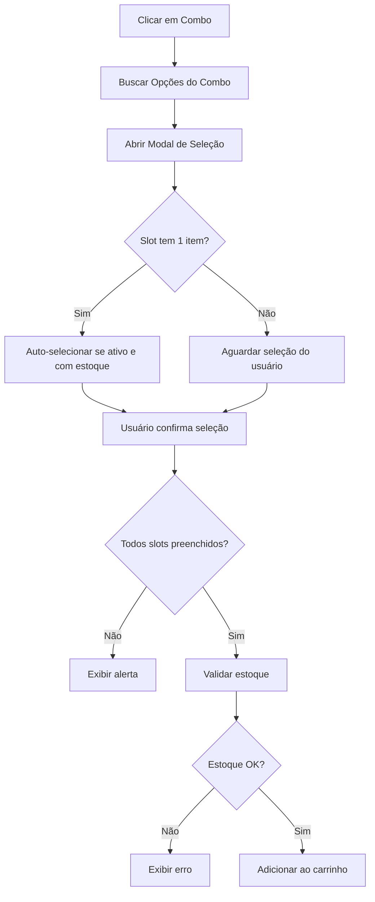
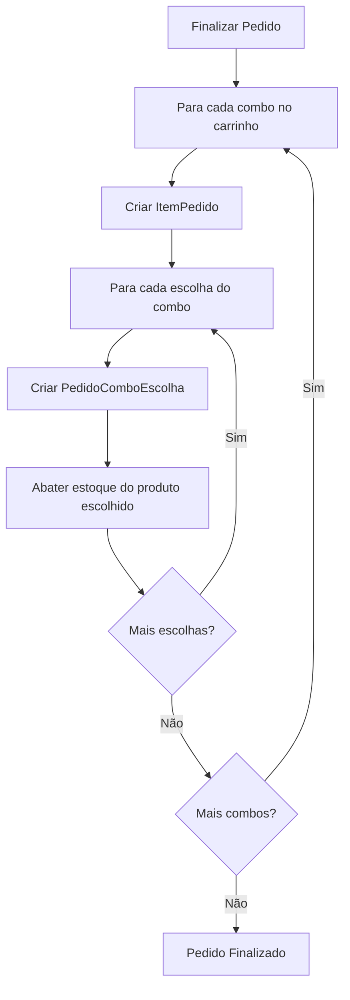

# 📦 Documentação do Sistema de Combos

## Índice
1. [Visão Geral](#visão-geral)
2. [Arquitetura](#arquitetura)
3. [Modelos de Dados](#modelos-de-dados)
4. [Fluxo de Funcionamento](#fluxo-de-funcionamento)
5. [APIs e Endpoints](#apis-e-endpoints)
6. [Interface do Usuário](#interface-do-usuário)
7. [Validações e Regras de Negócio](#validações-e-regras-de-negócio)
8. [Correções e Melhorias](#correções-e-melhorias)
9. [Troubleshooting](#troubleshooting)

---

## Visão Geral

O Sistema de Combos permite criar produtos compostos por múltiplas escolhas organizadas em "slots". Cada slot representa uma categoria de escolha (ex: "Lanche", "Bebida", "Acompanhamento") e contém opções que o cliente pode selecionar.

### Características Principais
- ✅ Criação de combos com múltiplos slots
- ✅ Cada slot pode ter uma ou mais opções
- ✅ Controle de estoque automático
- ✅ Seleção automática quando há apenas 1 opção
- ✅ Validação de disponibilidade em tempo real
- ✅ Produtos inativos aparecem mas não podem ser selecionados
- ✅ Categoria especial "Combo" (não editável)

---

## Arquitetura

### Estrutura de Componentes

```
Sistema de Combos
├── Backend (Django)
│   ├── Models (caixa/models.py)
│   │   ├── Combo
│   │   ├── ComboSlot
│   │   └── ComboSlotItem
│   ├── Views (caixa/views.py)
│   │   ├── configurar_combo()
│   │   ├── obter_opcoes_combo()
│   │   ├── adicionar_combo_pedido()
│   │   └── listar_produtos_para_combo()
│   └── Admin (caixa/admin.py)
│       └── ComboAdmin (inline para slots e itens)
│
└── Frontend (templates/caixa/dashboard.html)
    ├── Modal de Configuração (Aba Estoque)
    │   ├── Informações do Combo
    │   └── Gerenciamento de Slots
    └── Modal de Seleção (Aba Novo Pedido)
        ├── Informações do Combo
        └── Seleção de Opções por Slot
```

---

## Modelos de Dados

### 1. Combo
Representa o produto combo em si.

```python
class Combo(models.Model):
    produto = models.OneToOneField(Produto, on_delete=models.CASCADE)
    criado_em = models.DateTimeField(auto_now_add=True)
    atualizado_em = models.DateTimeField(auto_now=True)
```

**Relacionamento**: 1:1 com Produto (categoria "Combo")

**Métodos Principais**:
- `obter_slots_ordenados()`: Retorna slots ordenados por ordem
- `validar_integridade()`: Valida se o combo está configurado corretamente

### 2. ComboSlot
Representa uma categoria de escolha dentro do combo.

```python
class ComboSlot(models.Model):
    combo = models.ForeignKey(Combo, on_delete=models.CASCADE, related_name='slots')
    nome = models.CharField(max_length=100)  # Ex: "Lanche", "Bebida"
    ordem = models.IntegerField(default=0)
```

**Relacionamento**: N:1 com Combo

**Métodos Principais**:
- `obter_itens_ativos()`: Retorna apenas itens com produtos ativos (DEPRECATED - ver correção)

### 3. ComboSlotItem
Representa uma opção disponível dentro de um slot.

```python
class ComboSlotItem(models.Model):
    slot = models.ForeignKey(ComboSlot, on_delete=models.CASCADE, related_name='itens')
    produto = models.ForeignKey(Produto, on_delete=models.PROTECT)
    quantidade_abate = models.DecimalField(max_digits=10, decimal_places=2, default=1)
```

**Relacionamento**: N:1 com ComboSlot, N:1 com Produto

**Métodos Principais**:
- `validar_estoque_disponivel()`: Verifica se há estoque suficiente

### 4. PedidoComboEscolha
Registra as escolhas feitas pelo cliente ao adicionar um combo ao pedido.

```python
class PedidoComboEscolha(models.Model):
    item_pedido = models.ForeignKey(ItemPedido, on_delete=models.CASCADE, related_name='combo_escolhas')
    slot = models.ForeignKey(ComboSlot, on_delete=models.PROTECT)
    produto_escolhido = models.ForeignKey(Produto, on_delete=models.PROTECT)
    quantidade_abatida = models.DecimalField(max_digits=10, decimal_places=2)
```

**Relacionamento**: N:1 com ItemPedido

---

## Fluxo de Funcionamento

### 1. Criação de Combo (Aba Estoque)



**Passos Detalhados**:
1. Usuário clica em "🎁 Novo Combo" na aba Estoque
2. Modal de configuração é aberto
3. Usuário preenche:
   - Nome do combo
   - Preço do combo
4. Usuário adiciona slots (categorias de escolha)
5. Para cada slot, adiciona produtos disponíveis
6. Ao salvar, o sistema:
   - Cria o produto com categoria "Combo"
   - Cria o registro Combo
   - Cria os slots e itens associados
   - Retorna sucesso ou erro

### 2. Seleção de Combo (Aba Novo Pedido)



**Passos Detalhados**:
1. Usuário clica em um combo na lista de produtos
2. Sistema busca opções via API `/caixa/combo/{id}/opcoes/`
3. Modal de seleção é aberto mostrando todos os slots
4. Para cada slot:
   - Se tem apenas 1 item ativo com estoque: auto-seleciona
   - Se tem múltiplos itens: aguarda seleção do usuário
   - Produtos inativos aparecem mas não podem ser selecionados
5. Usuário clica em "✅ Adicionar ao Pedido"
6. Sistema valida:
   - Todos os slots foram preenchidos
   - Todos os produtos têm estoque suficiente
7. Se válido, adiciona ao carrinho
8. Ao finalizar pedido, o estoque é abatido

### 3. Finalização de Pedido com Combo



---

## APIs e Endpoints

### 1. Configurar Combo
**Endpoint**: `POST /caixa/combo/configurar/`

**Payload**:
```json
{
  "nome": "Combo X-Burger",
  "preco": 22.00,
  "slots": [
    {
      "nome": "Lanche",
      "itens": [
        {"produto_id": 1, "quantidade_abate": 1}
      ]
    },
    {
      "nome": "Bebida",
      "itens": [
        {"produto_id": 5, "quantidade_abate": 1},
        {"produto_id": 6, "quantidade_abate": 1}
      ]
    }
  ]
}
```

**Resposta Sucesso**:
```json
{
  "success": true,
  "combo_id": 1,
  "message": "Combo criado com sucesso!"
}
```

**Resposta Erro**:
```json
{
  "success": false,
  "error": "Mensagem de erro"
}
```

### 2. Obter Opções do Combo
**Endpoint**: `GET /caixa/combo/{combo_id}/opcoes/`

**Resposta**:
```json
{
  "success": true,
  "combo_id": 1,
  "nome": "Combo X-Burger",
  "preco": 22.00,
  "slots": [
    {
      "id": 1,
      "nome": "Lanche",
      "ordem": 0,
      "itens": [
        {
          "produto_id": 1,
          "nome": "X-Burger",
          "quantidade_abate": 1.0,
          "estoque_disponivel": 14,
          "produto_ativo": false,
          "tem_estoque_suficiente": false
        }
      ]
    },
    {
      "id": 2,
      "nome": "Bebida",
      "ordem": 1,
      "itens": [
        {
          "produto_id": 5,
          "nome": "Coca-Cola 350ml",
          "quantidade_abate": 1.0,
          "estoque_disponivel": 4,
          "produto_ativo": true,
          "tem_estoque_suficiente": true
        },
        {
          "produto_id": 6,
          "nome": "Café Expresso",
          "quantidade_abate": 1.0,
          "estoque_disponivel": 1001,
          "produto_ativo": true,
          "tem_estoque_suficiente": true
        }
      ]
    }
  ]
}
```

**Campos Importantes**:
- `produto_ativo`: Indica se o produto está ativo (pode ser selecionado)
- `tem_estoque_suficiente`: Indica se há estoque suficiente para a quantidade_abate
- `estoque_disponivel`: Quantidade atual em estoque

### 3. Adicionar Combo ao Pedido
**Endpoint**: `POST /caixa/combo/adicionar-pedido/`

**Payload**:
```json
{
  "combo_id": 1,
  "escolhas": [
    {
      "slot_id": 1,
      "produto_id": 1,
      "produto_nome": "X-Burger",
      "quantidade_abate": 1
    },
    {
      "slot_id": 2,
      "produto_id": 5,
      "produto_nome": "Coca-Cola 350ml",
      "quantidade_abate": 1
    }
  ]
}
```

**Resposta Sucesso**:
```json
{
  "success": true,
  "combo": {
    "id": 1,
    "nome": "Combo X-Burger",
    "preco": 22.00,
    "escolhas": [...]
  }
}
```

### 4. Listar Produtos para Combo
**Endpoint**: `GET /caixa/combo/produtos/`

**Resposta**:
```json
{
  "success": true,
  "produtos": [
    {
      "id": 1,
      "nome": "X-Burger",
      "preco": 15.00,
      "estoque": 14,
      "ativo": false
    },
    ...
  ]
}
```

---

## Interface do Usuário

### Modal de Configuração (Aba Estoque)

**Layout**: 2 colunas
- **Coluna Esquerda (350px)**: Informações do combo
  - Nome do combo
  - Preço do combo
  - Botão "Salvar Combo"
  
- **Coluna Direita (flex)**: Gerenciamento de slots
  - Lista de slots com scroll independente
  - Botão "➕ Adicionar Slot"
  - Para cada slot:
    - Nome do slot
    - Lista de itens
    - Botões: Adicionar Item, Editar, Excluir

**Responsividade**: Em telas < 968px, empilha em 1 coluna

### Modal de Seleção (Aba Novo Pedido)

**Layout**: Coluna única
- **Cabeçalho**: Nome e preço do combo
- **Corpo**: Lista de slots
  - Para cada slot:
    - Nome do slot (ex: "📋 Lanche")
    - Grid de opções (2 colunas em desktop, 1 em mobile)
    - Cada opção mostra:
      - Nome do produto
      - Estoque disponível
      - Check (✓) se selecionado
      - Estilo visual diferente se inativo/sem estoque

**Estados Visuais**:
- **Normal**: Borda cinza, fundo escuro
- **Selecionado**: Borda laranja, fundo laranja claro, check visível
- **Sem estoque/Inativo**: Opacidade 50%, cursor not-allowed, texto vermelho

---

## Validações e Regras de Negócio

### 1. Criação de Combo

✅ **Validações Obrigatórias**:
- Nome do combo não pode estar vazio
- Preço deve ser maior que zero
- Deve ter pelo menos 1 slot
- Cada slot deve ter pelo menos 1 item
- Categoria é automaticamente definida como "Combo"

❌ **Erros Comuns**:
- "Nome do combo é obrigatório"
- "Preço deve ser maior que zero"
- "Adicione pelo menos um slot"
- "O slot '{nome}' não possui itens"

### 2. Seleção de Combo

✅ **Validações Obrigatórias**:
- Todos os slots devem ser preenchidos
- Produtos selecionados devem estar ativos
- Produtos selecionados devem ter estoque suficiente

✅ **Seleção Automática**:
- Quando um slot tem apenas 1 item
- E o produto está ativo
- E há estoque suficiente
- → O item é automaticamente selecionado

❌ **Erros Comuns**:
- "Por favor, selecione um item para todos os slots (X/Y)"
- "Este item não está disponível (produto inativo ou sem estoque)"
- "Estoque insuficiente para {produto}"

### 3. Finalização de Pedido

✅ **Validações Obrigatórias**:
- Revalidar estoque de todos os produtos escolhidos
- Abater estoque de cada produto escolhido
- Criar registros de PedidoComboEscolha

✅ **Abate de Estoque**:
- Para cada escolha no combo:
  - `produto.quantidade_estoque -= quantidade_abate`
  - Salvar produto

### 4. Exclusão de Pedido

✅ **Devolução de Estoque**:
- Para cada combo no pedido:
  - Para cada escolha:
    - `produto.quantidade_estoque += quantidade_abatida`
    - Salvar produto

---

## Correções e Melhorias

### Problema: Slots com 1 Item Não Apareciam

**Data**: 11/02/2026

**Descrição do Problema**:
Quando um slot tinha apenas 1 item e esse item estava inativo, o slot não aparecia no modal de seleção. Isso ocorria porque a API filtrava apenas produtos ativos usando `obter_itens_ativos()`.

**Exemplo**:
```
Combo: "Combo X-Burger"
├── Slot: "Lanche" (1 item)
│   └── X-Burger (INATIVO) ❌ Não aparecia
└── Slot: "Bebida" (2 itens)
    ├── Coca-Cola (ATIVO) ✅
    └── Café (ATIVO) ✅
```

**Causa Raiz**:
```python
# ANTES (caixa/views.py)
for slot in combo.obter_slots_ordenados():
    itens_data = []
    for item in slot.obter_itens_ativos():  # ❌ Filtrava apenas ativos
        # ...
```

**Solução Implementada**:

1. **Backend (caixa/views.py)**:
```python
# DEPOIS
for slot in combo.obter_slots_ordenados():
    itens_data = []
    for item in slot.itens.all():  # ✅ Busca TODOS os itens
        produto_ativo = item.produto.ativo
        tem_estoque = item.validar_estoque_disponivel() if produto_ativo else False
        
        itens_data.append({
            'produto_id': item.produto.id,
            'nome': item.produto.nome,
            'quantidade_abate': float(item.quantidade_abate),
            'estoque_disponivel': item.produto.quantidade_estoque,
            'produto_ativo': produto_ativo,  # ✅ Novo campo
            'tem_estoque_suficiente': tem_estoque
        })
```

2. **Frontend (templates/caixa/dashboard.html)**:
```javascript
// ANTES
const semEstoque = item.tem_estoque_suficiente === false;
const classeEstoque = semEstoque ? 'sem-estoque' : '';

// DEPOIS
const produtoInativo = item.produto_ativo === false;
const semEstoque = item.tem_estoque_suficiente === false;
const naoSelecionavel = produtoInativo || semEstoque;

let mensagemEstoque = '';
if (produtoInativo) {
    mensagemEstoque = 'Produto inativo ⚠️';
} else if (semEstoque) {
    mensagemEstoque = `Estoque: ${item.estoque_disponivel} ⚠️`;
} else {
    mensagemEstoque = `Estoque: ${item.estoque_disponivel}`;
}
```

**Resultado**:
- ✅ Todos os itens configurados aparecem no modal
- ✅ Produtos inativos são exibidos com mensagem clara
- ✅ Produtos inativos não podem ser selecionados
- ✅ Feedback visual diferenciado (opacidade, cursor, mensagem)

### Logs de Debug Adicionados

**Backend**:
```python
logger.info(f"=== OBTER OPÇÕES DO COMBO {combo_id} ===")
logger.info(f"Combo encontrado: {combo.produto.nome}")
logger.info(f"Total de slots: {slots.count()}")
logger.info(f"Processando slot: {slot.nome} (ID: {slot.id})")
logger.info(f"  Total de itens no slot: {itens.count()}")
logger.info(f"    Item: {item.produto.nome} - Ativo: {produto_ativo} - Estoque: {item.produto.quantidade_estoque}")
```

**Frontend**:
```javascript
console.log('=== ABRINDO MODAL DE SELEÇÃO DE COMBO ===');
console.log('Combo ID:', comboId);
console.log('Resposta da API:', data);
console.log('Total de slots:', data.slots.length);
console.log(`Slot ${index + 1}: ${slot.nome} - ${slot.itens.length} itens`);
console.log(`  Item ${itemIndex + 1}: ${item.nome} - Estoque: ${item.estoque_disponivel}`);
```

---

## Troubleshooting

### Problema: Slot vazio no modal

**Sintoma**: Ao abrir o modal de seleção, um slot não mostra nenhum item.

**Diagnóstico**:
1. Abra o Console do navegador (F12)
2. Clique no combo
3. Verifique os logs:
```
=== ABRINDO MODAL DE SELEÇÃO DE COMBO ===
Combo ID: 1
Resposta da API: {...}
Total de slots: 2
Slot 1: Lanche - 1 itens
  Item 1: X-Burger - Estoque: 14
Slot 2: Bebida - 2 itens
  Item 1: Coca-Cola 350ml - Estoque: 4
  Item 2: Café Expresso - Estoque: 1001
```

**Possíveis Causas**:
1. ✅ **Produto inativo**: Verifique se `produto_ativo: false` nos logs
2. ✅ **Slot sem itens**: Verifique se o slot foi configurado corretamente
3. ✅ **Erro na API**: Verifique se há erro 404 ou 500

**Solução**:
- Se produto inativo: Ative o produto na aba Estoque
- Se slot sem itens: Edite o combo e adicione itens ao slot
- Se erro na API: Verifique os logs do servidor Django

### Problema: Não consigo selecionar um item

**Sintoma**: Ao clicar em um item, nada acontece ou aparece alerta.

**Diagnóstico**:
1. Verifique se o item tem a classe `sem-estoque`
2. Verifique a mensagem exibida:
   - "Produto inativo ⚠️" → Produto está inativo
   - "Estoque: X ⚠️" → Sem estoque suficiente

**Solução**:
- Se produto inativo: Ative o produto na aba Estoque
- Se sem estoque: Adicione estoque ao produto

### Problema: Erro ao finalizar pedido com combo

**Sintoma**: Ao finalizar pedido, aparece erro "Estoque insuficiente".

**Diagnóstico**:
1. Verifique se outro usuário finalizou pedido com o mesmo produto
2. Verifique se o estoque foi atualizado manualmente

**Solução**:
- Reabra o modal de seleção do combo
- Selecione outra opção com estoque disponível
- Ou adicione estoque ao produto

### Problema: Combo não aparece na lista de produtos

**Sintoma**: Combo criado mas não aparece na aba Novo Pedido.

**Diagnóstico**:
1. Verifique se o combo está ativo
2. Verifique se a categoria é "Combo"

**Solução**:
- Na aba Estoque, encontre o combo
- Clique em Editar
- Verifique se está marcado como "Ativo"
- Verifique se a categoria é "🎁 Combo"

---

## Boas Práticas

### 1. Criação de Combos

✅ **Recomendações**:
- Use nomes descritivos para slots (ex: "Lanche Principal", "Bebida", "Sobremesa")
- Mantenha a ordem lógica dos slots (lanche → bebida → sobremesa)
- Adicione pelo menos 2 opções por slot quando possível
- Verifique o estoque dos produtos antes de adicionar ao combo
- Defina preços competitivos (combo deve ser mais barato que itens separados)

❌ **Evite**:
- Slots com nomes genéricos ("Slot 1", "Opção")
- Adicionar produtos sem estoque
- Criar combos com apenas 1 slot
- Preços muito altos (combo perde atratividade)

### 2. Gerenciamento de Estoque

✅ **Recomendações**:
- Monitore o estoque dos produtos mais usados em combos
- Mantenha produtos de combo sempre ativos
- Configure alertas de estoque baixo
- Reponha estoque regularmente

❌ **Evite**:
- Desativar produtos que fazem parte de combos populares
- Deixar produtos de combo sem estoque
- Criar combos com produtos de alta rotatividade sem controle

### 3. Experiência do Usuário

✅ **Recomendações**:
- Crie combos com opções variadas
- Use nomes atrativos para combos
- Mantenha preços atualizados
- Teste a seleção de combos regularmente

❌ **Evite**:
- Combos muito complexos (muitos slots)
- Opções confusas ou redundantes
- Preços desatualizados

---

## Referências

### Arquivos Relacionados

**Backend**:
- `caixa/models.py` - Modelos Combo, ComboSlot, ComboSlotItem, PedidoComboEscolha
- `caixa/views.py` - Views configurar_combo, obter_opcoes_combo, adicionar_combo_pedido
- `caixa/urls.py` - Rotas do sistema de combos
- `caixa/admin.py` - Interface administrativa

**Frontend**:
- `templates/caixa/dashboard.html` - Modais de configuração e seleção
- `static/css/style.css` - Estilos dos modais e cards

**Migrations**:
- `caixa/migrations/0004_combo_comboslot_comboslotitem_pedidocomboescolha.py`
- `caixa/migrations/0005_remove_comboslotitem_unique_constraint.py`
- `caixa/migrations/0007_categoria_is_sistema.py`
- `caixa/migrations/0008_criar_categoria_combo.py`

### Documentação Adicional

- [DOCUMENTACAO_FRONTEND_CAIXA.md](DOCUMENTACAO_FRONTEND_CAIXA.md) - Documentação geral da tela do caixa
- [ESTRUTURA_BD.md](ESTRUTURA_BD.md) - Estrutura completa do banco de dados
- [GUIA_VISUAL.md](GUIA_VISUAL.md) - Guia de identidade visual

---

**Última Atualização**: 11/02/2026  
**Versão**: 2.0  
**Autor**: Sistema Cantina
